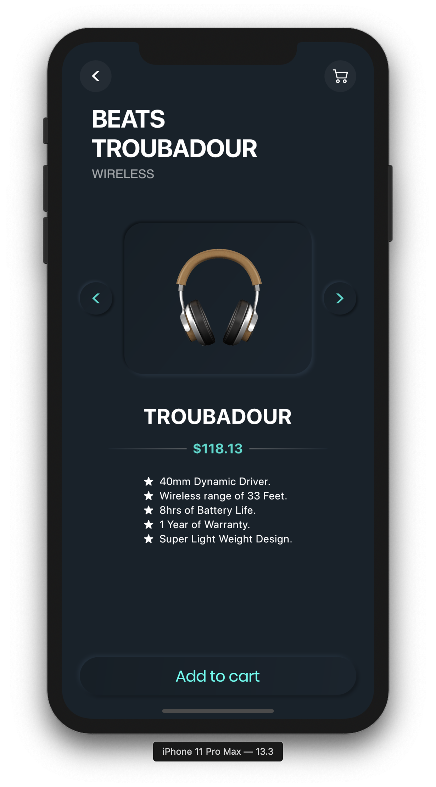

# Headphone Store

A Headphone Store Concept Design

## Screenshots of the application

A headphone store application made in Flutter, incorporating the neumorphic UI design, in the appropriate amount. The neumorphic UI buttons and placeholders were made super easy with help of Dart code generator for neumorphic widgets using [https://flutterneumorphism.com](https://flutterneumorphism.com).

If you like the above tool, star the repo here: [Flutter-Neumorphism](https://github.com/Neelansh-ns/Flutter-Neumorphism)

Screen 0             |  Screen 1
:-------------------------:|:-------------------------:
 | 

## Design Credits

The above designs were made by Yash Parashar.\
Link: [https://dribbble.com/shots/11080842-Headphone-Store](https://dribbble.com/shots/11080842-Headphone-Store)
